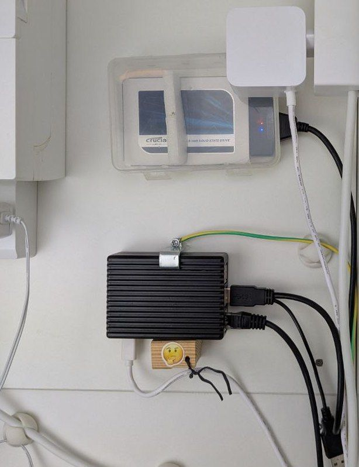

# Zia - Personal AI Assistant

Zia is a **hobby project** - a personal AI assistant designed to collect, organize, and intelligently process your private data. It uses a local LLM running on your own hardware, ensuring your sensitive information never leaves your control.

## Target Users

Zia is built for privacy-conscious individuals who:

- Want AI assistance without exposing personal data to cloud services
- Are comfortable self-hosting a backend on a Raspberry Pi or similar device
- Use encrypted storage to protect data at rest
- Value ownership and control over their personal information

## Architecture

Zia separates the user interface from data storage:

- [x] **Frontend (UI)**: Hosted on GitHub Pages - no self-hosting required. The UI contains no private data and can be used directly from the web.
- [ ] **Backend**: Self-hosted on your own hardware (e.g., Raspberry Pi with encrypted HDD). All private data and LLM processing stays here.
- [x] **Multi-backend support**: The frontend can switch between different backends (e.g., home vs. work) while preserving settings and authorizations for each.



## Security

- [x] Backend protected with JWT authentication (OAuth2/PKCE via AWS Cognito)
- [x] Private data is never stored outside your encrypted HDD (though it is delivered via HTTPS and displayed in your browser)
- [x] Designed for encrypted storage (data at rest)

## Features

- [ ] Collect and organize personal documents (bills, contracts, communications)
- [ ] Keep data up-to-date and searchable
- [ ] Local LLM processing for intelligent queries and insights
- [x] Modern, responsive web interface with dark mode support

## Feature Ideas

### Incoming Call Assistant

When your phone rings, Zia shows contextual information about the caller:

- Recent call history and communication summary
- Personal relations (e.g., "Homer - borrowed leafblower 4.5 months ago")
- AI-powered suggestions based on past conversations (e.g., "2 months ago, caller mentioned planning a trip to Barbados")
- Quick links to related documents and notes

### Proactive Shopping Assistant

When you want to buy something (e.g., a used car), Zia works for you continuously:

- Monitors listings daily based on your vague preferences
- Assesses and ranks options using AI judgment
- Presents top 5 picks with reasoning
- Tracks price changes and new listings over time

## Deployment

- **UI**: [https://zia.bin932.com](https://zia.bin932.com) (automatically deployed from main branch)
- **Backend**: [https://zia-be.bin932.com:3150/info.json](https://zia-be.bin932.com:3150/info.json)

## Development

```bash
npm install      # Install dependencies
npm run dev      # Start development server (http://localhost:3000)
npm run build    # Build for production
npm run lint     # Run ESLint
npm run test     # Run tests
```
